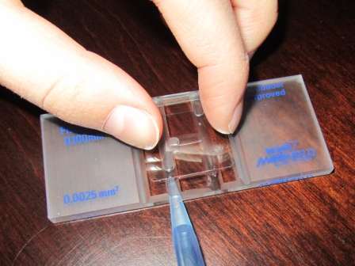
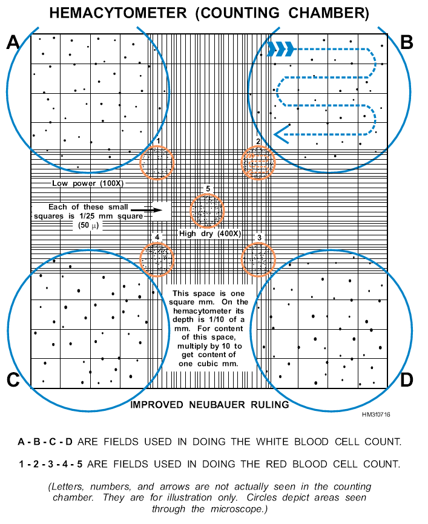

<!-- Limit image width and height -->
<style type='text/css'>
img {
    max-height: 560px;
    max-width: 964px;
}
</style>

<!-- Center image on slide -->
<script src="http://ajax.aspnetcdn.com/ajax/jQuery/jquery-1.7.min.js"></script>
<script type='text/javascript'>
$(function() {
    $("p:has(img)").addClass('centered');
});
</script>

## App Overview

- This app was designed to facilitate the work on the lab using cell count to perform experments like cell culture in vitro or flow citometry analysis.
- The main idea is count the cell number in the Neubauer chamber that will be used as the input in the App.
- You can input the counted cells, dilution factor of your cell suspension and the number of fields counted in the Neubauer chamber.



---

## Neubauer chamber count

- The neubaur is visualized in microscope under magnification. You'll see an image like the image below.



---

## Output interpretation

 - The final count is used to calculate the volume to be pipette to make a reaction under a known cell number. So, one of the outputs in the app will show the volume in uL to acquire your desired cell concentration.
- This volume with the known cell number will be used to set another reaction.
- This counts will facilitate the time during the laboratory procedures.

Cell concentration ($cells/mL$) = (Total cell count)/ (# of squares) * $10^4$ * Dilution factor

Volume cell suspension with cell number desired = Desired cell concentration / Cell concentration

---

## Example

- I take a suspention in a cell culture medium containing cells of spleen. I want know the cell number per mL, and I want to obtain $1*10^6$ cells to make my reaction.  I count 2 fields in the newbauer, into a dilution of $1/20$. The number of cells that I obtained was `156` cells.

Calculating the cell concentration:
cell concentration = x


```r
x <- (156/2)*(10^4)*20
print(x)
```

```
## [1] 15600000
```
Final cell concentration = `15600000`

---

## Example

Calculating the volume of suspention to obtain $1*10^6$ cells.
Volume of suspension containing $1*10^6$ cells = y

```r
y <- (1*10^6)/x
print(y)
```

```
## [1] 0.06410256
```
Volume to pipette = `0.64`uL

- CellApp will do that calculation to you!
